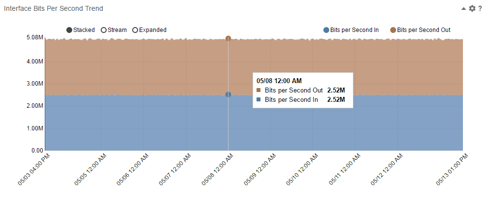

# simpleTrends
An interactive trend view of bits per second for use in an interface context page.

Based on the NVD3 library.

#### Install and Configure

1. Download the folder containing the app (e.g., click Download ZIP above). Unzip the download if need be and make sure the unzipped folder is named simpleTrends.
3.  Copy the folder to the webapps/pc/apps/user directory of your PC installation.  This is normally:  
        /opt/CA/PerformanceCenter/PC/webapps/pc/apps/user  
There is no need to start or restart PC.
4. In PC, open a context page for an interface (Inventory -> Interfaces) and edit one of the tabs of the context page.
5. Add a browser view to the page. Configure the browser view with:  
an appropriate title,  
a height of 400,  
the URL as described below.  
6. Save your modified context page and see the app work.

#### CAPC Browser View URL

The URL used to run the app is:

/pc/apps/user/simpleTrends/multiMetric.html?id={ItemIdDA}&startTime={TimeStartUTC}&endTime={TimeEndUTC}

Parameters:  
id: is the ID of the interface for the selected context page  
startTime: is the start time selected in the context page's time picker  
endTime: is the end time selected in the context page's time picker

#### Modifying the App